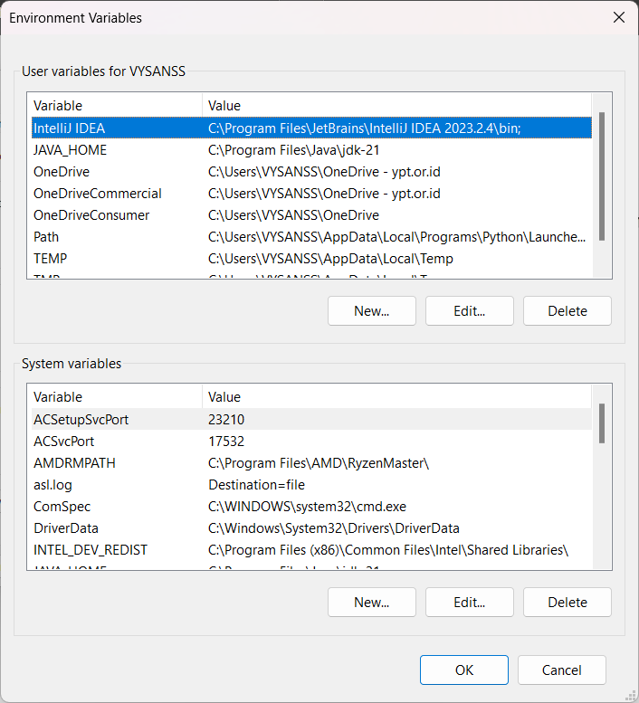
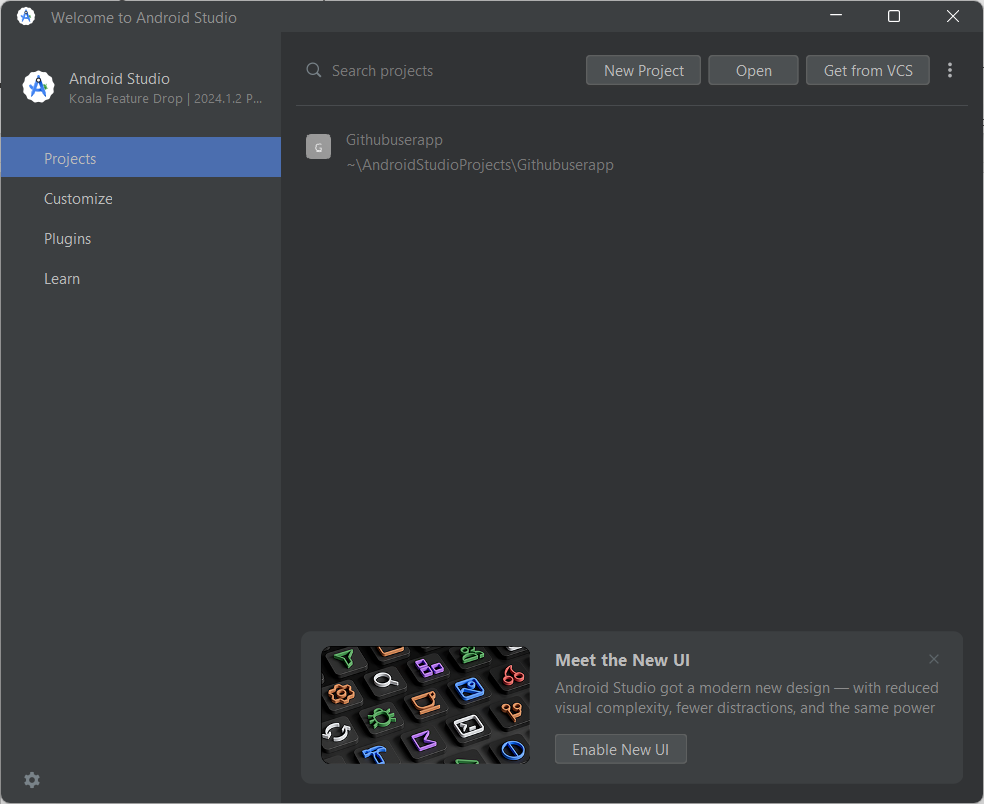
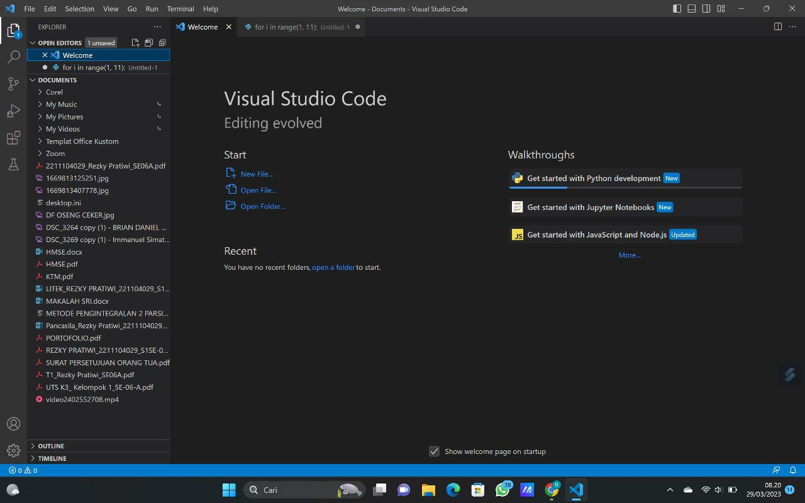

> **LAPORAN** **PRAKTIKUM**
>
> **Pemrograman** **Perangkat** **Bergerak**
>
> 
>
> **Oleh** **:**
>
> **Muhamad** **Luthfi** **Hamdani** **(2211104020)**
>
> **PRODI** **S1** **REKAYASA** **PERANGKAT** **LUNAK**
>
> **FAKULTAS** **INFORMATIKA** **UNIVERSITAS** **TELKOM** **PURWOKERTO**
>
> **2024**

> **MODUL** **1.** **RUNNING** **MODUL**
>
> **1.1.** **Instalasi** **GIT**
>
> 1\. Buka link berikut ini untuk mengunduh Git.
> [<u>https://git-scm.com/downSload/win</u>](https://git-scm.com/downSload/win)
> 2. Klik dua kali pada file yang sudah diunduh.
>
> 3\. Maka akan muncul informasi lisensi Git, klik next untuk
> melanjutkan.
>
>  style="width:3.19931in;height:2.64958in" />4. Pada bagian ini, Anda
> dapat memilih komponen apa saja yang akan dipasang, jika sudah klik
> next untuk melanjutkan.

> 5\. Jika sudah klik install dan tunggu proses instalasi nya
>
>  style="width:3.23958in;height:2.68292in" />6. Lalu klik finish
>
> **1.2** **Instalasi** **JDK**
>
>  style="width:5.17417in;height:2.91042in" />1. buka link
> [<u>https://www.oracle.com/java/technologies/javase-jdk15-downloads.html</u>](https://www.oracle.com/java/technologies/javase-jdk15-downloads.html)
> untuk download, lalu pilih sesuai dengan sistem operasi pada perangkat
> yang digunakan
>
> 2\. Buka file instalasi yang telah didownload, lalu klik next. Buka
> file instalasi yang
>
>  style="width:4.54986in;height:3.46458in" />telah didownload, lalu klik
> next.
>
>  style="width:4.39125in;height:3.34375in" />3. Pilih folder path tempat
> menyimpan instalasi JDK, direkomendasikan sesuai dengan yang telah
> tertera pada proses instalasi, lalu klik next.
>
>  style="width:4.37708in;height:3.33305in" />4. Tunggu instalasi hingga
> selesai.

> 5\. Setelah proses instalasi selesai klik close.
>
>  style="width:5.15806in;height:2.90417in" />6. Akses folder instalasi
> tadi lalu copy pathnya.

> 7\. Search envronment variable, lalu buka aplikasi tersebut.
>
>  style="width:3.46625in;height:3.63125in" />8. Pada tab advance klik
> Environment Variables

> 9\. Selanjutnya pada user variables klik path
>
>  style="width:4.34819in;height:1.26458in" />10. Masukan informasi
> variable name “JAVA_HOME” lalu variable value (paste file path jdk
> tadi)
>
>  style="width:4.38167in;height:1.27431in" />11.

> 12\. Klik OK untuk menyelesaikan proses instalasi.
>
> **1.3.** **Instalasi** **Flutter** **SDK**
>
> 1\. Unduh Flutter SDK pada link dibawah ini, dan pastikan unduh versi
> yang stabil dan yang terbaru dari Flutter. Sesuaikan juga dengan
> sistem operasi yang dimiliki. Flutter SDK dapat diunduh melalui link:
> [<u>https://flutter.dev/docs/development/tools/sdk/releases</u>](https://flutter.dev/docs/development/tools/sdk/releases)
>
> 2\. Ekstrak berkas zip dan tempatkan folder flutter pada lokasi
> instalasi yang diinginkan untuk Flutter SDK, misalnya C:\Development.
>
> 3\. Temukan berkas flutter_console.bat di dalam direktori flutter
> tersebut. Mulai dengan klik dua kali atau jalankan script tersebut dan
> Anda sekarang siap untuk

> menjalankan perintah Flutter di Flutter Console.
>
> 4\. Tampilan dari flutter_console.bat seperti di bawah ini:
>
> 5\. Update Path
>
> Langkah ini bertujuan agar perintah Flutter bisa digunakan pada
> command prompt/terminal. Berikut langkah-langkahnya: 1. Dari bar
> pencarian di Start menu, ketik ‘env’ dan pilih Edit Environment
> Variable untuk akun Anda. 2. Klik

> pada tombol Environment Variables.
>
> 6\. Di bawah User variabel periksa apakah ada entri yang disebut PATH,
> jika ada
>
>  style="width:3.83055in;height:4.21583in" />maka pilih lalu edit, jika
> tidak ada maka buat baru dengan nama variabel Path.
>
> 7\. Edit atau tambahkan value-nya dengan direktori Flutter SDK.
>
> a\. Jika terdapat entri, tambahkan path lengkap ke flutter\bin
> menggunakan tanda titik koma (;) sebagai pemisah dari nilai yang ada
> (jika menggunakan mode edit satu baris).
>
>  style="width:3.46042in;height:3.81653in" />b. Jika entri tidak
> ditemukan, buat user variabel baru dan beri nama Path dan beri nilai
> flutter\bin sebagai nilainya.
>
> 8\. Flutter Doctor Flutter doctor merupaka perintah untuk mengecek
> kelengkapan
>
> framework
> flutter yang akan digunakan, seperti versi, Android SDK yang
> digunakan, iOS SDK yang digunakan (tersedia di MacOS), perangkat yang
> terhubung, dan lain-lain). Jalankan perintah berikut untuk membuka
> flutter doctor:
>
> **1.4.** **InstalasiAndroid** **Studio**
>
> 1\. Download aplikasi Android Studio terbaru pada
> [<u>https://developer.android.com/studio</u>.](https://developer.android.com/studio)
> Tersedia untuk Sistem Operasi Windows, Mac dan Linux.
>
> 2\. Proses instalasi
>
> a\. Jika mendownload file .exe, double-click untuk menjalankan, Jika
> mendownload file .zip, buka paket ZIP, salin folder android-studio ke
> folder Program Files, lalu buka folder android-studio -\> bin dan
> jalankan studio64.exe (untuk mesin 64-bit) atau studio.exe (untuk
> mesin 32-bit).
>
>  style="width:4.1743in;height:3.42708in" />b. Akan tampil gambar
> seperti dibawah ini. Klik next untuk melanjutkan aplikasi.
>
>  style="width:3.83611in;height:3.14944in" />3. Pastikan Android Virtual
> Device ter-checklist untuk optimasi virtual device untuk testing pada
> emulator. Lalu klik next.
>
>  style="width:3.92472in;height:3.22222in" />4. Pilih folder path tempat
> kamu ingin menginstall aplikasi, setelah itu klik next.

> 5\. Pilih folder untuk membuat shortcut. Klik install untuk
> melanjutkan.
>
>  style="width:4.02917in;height:3.30792in" />6. Tunggu proses instalasi
> hingga selesai

> 7\. Setelah proses instalasi selesai, klik next dan finish.
>
> 8\. Jika belum memiliki installation folder (biasanya pada pertama
> kali install)
>
> pilih Do not import setting.
>
>  style="width:4.34444in;height:3.54972in" />9. Tunggu proses Android
> Studio hingga berjalan. 10. buat New Project.

> 11\. Pilih Empty Activity lalu klik next.
>
>  style="width:5.00903in;height:3.61667in" />12. Silahkan masukan nama
> aplikasi serta bahasa pemrograman yang diinginkan, pada modul ini kita
> akan menggunakan bahasa pemrograman Java, Klik finish.

> 1.5. Instalasi SDK Android
>
> 1\. Klik tools pada menu bar lalu Klik SDK Manager.
>
> 2\. Pada SDK Platform checklist SDK yang kamu butuhkan, lalu pindah ke
> tab
>
>  style="width:4.60069in;height:3.37639in" />SDK Tools.

> 3\. Pada SDK Tools checklist tools yang kamu butuhkan, setelah itu
> klik OK.
>
> 4\. Lalu akan muncul keterangan perubahan, klik OK.
>
> 5\. Accept setiap LicenceAgreement untuk mendownload SDK tools yang
> dipilih, lalu klik next.

> 6\. Tunggu download dan instalasi hingga selesai, lalu klik Finish.
>
> **1.6.** **Instalasi** **Visual** **Studio** **Code**

1. Pertama kunjungihalaman
[<u>https://code.visualstudio.com/Download</u>](https://code.visualstudio.com/Download),
lalu klik download sesuai device yang digunakan. Lalu tunggu hingga
download selesai.

2\. Setelah download selesai, buka installer lalu install aplikasi
seperti biasa.

3\. Tunggu hingga proses instalasi selesai.

4. Setelah selesai maka, akan
muncul tampilan seperti di bawah, centang **Launch** **Visual**
**Studio** **Code**, lalu finish.

5\. Dan Aplikasi VS Code pun terinstall.

> **1.7.** **Instalasi** **Extension** **Visual** **Studio** **Code**
>
> 1\. Dart Extension ini perlu diinstal karena untuk menjalankan
> Flutter, kita perlu menginstal Dart agar aplikasi yang dibuat bisa
> berjalan dan tidak terjadinya

> error.
>
> 2\. Flutter Extension ini sangat penting ketika ingin membuat aplikasi
>
>  style="width:4.99639in;height:2.81042in" />menggunakan Flutter di
> visual studio code.
